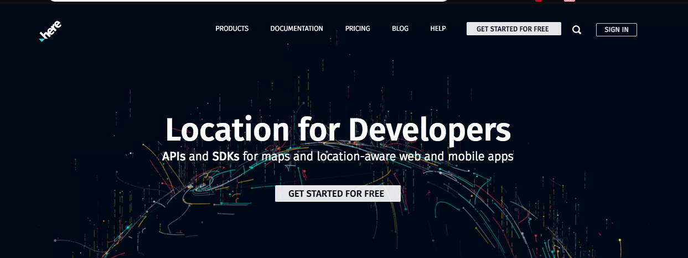
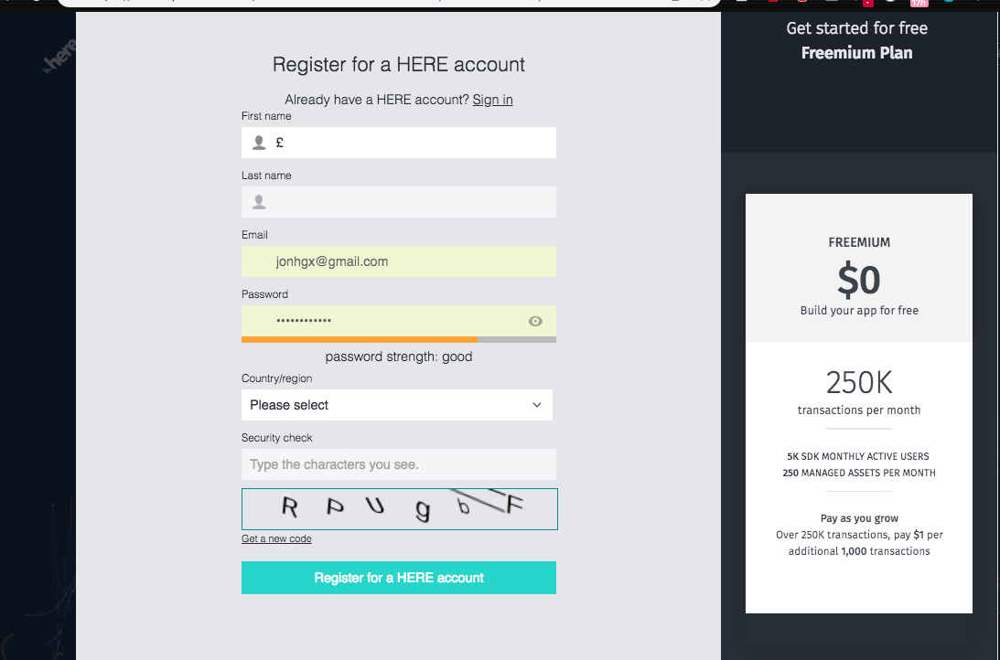

# Hackathon  Laboratoria CDMX - HERE

## CONTEXTO - PROBLEMA:

La cuestión de la logística en escuelas con el transporte escolar es universal. Todos los días, en varios países, padres, madres, niños, niñas, conductores, directores de escuela, gestores de flota escolar tienen que comunicarse y transportar niños con seguridad y confort. 
Los padres se quedan esperando la llegada del transporte escolar y este a veces retrasa el servicio debido al tráfico en las ciudades que genera pérdidas de tiempo, al mismo tiempo los padres no saben que hacer. El conductor tiene que saber de memoria o tener una lista de papel con los niños a recoger. En algunas ocasiones llega y el niño está enfermo, o sea, la familia no pudo comunicarse con el chofer a tiempo, y toda la cadena tiene problemas. También el conductor puede exceder los limites de velocidad sin que las familias y la escuela sepan, o el vehículo puede no tener los servicios al día y poner en riesgo a los niños y al transporte, así como alertas meteorológicas, alertas de proximidad con la escuela o las residencias.

## DESAFÍO - SOLUCIÓN

Se espera la creación de una webApp para hacer toda la gestión posible de transporte escolar, conectando secretarías de educación, escuelas, familias, niños, gestores de flota, conductores, etc y todo lo que no pensamos arriba.

### Funciones básicas

- Visualizar la ruta del camion contemplando a los niños que tendrá que recoger 
- Generar alertas (para los padres y la escuela)
- Agendar/cancelar búsqueda de un niño.
- Alertas del chofer en caso de cualquier problema.
- Compartir situaciones y updates diarios, recurridos, comentarios etc.
- App con funciones de seguridad
- Monitoreo por parte de padres y escuela.
- Generar diariamente la ruta optima teniendo en cuenta cualquier cambio (una enfermedad o compromiso personal de la familia, o aviso de la escuela, huelgas y protestas, etc).
- Cargar/añadir lista de ubicaciones o buscar dirección.
- Perfil personalizado, con visores e informaciones diferentes para: escuela, conductor, familia y niño
- Ubicar las casas de los niños, las escuelas, etc en el mapa.

_Nota: Para poder solicitar las llaves dentro de la plataforma de desarrollo de HERE y poder usar las APIS, se debe registrar dando click y siguiendo los pasos en [developers.here](https://developer.here.com/)_ 

 
Darle click al botón GET STARTED FOR FREE

 
Rellena el formulario

- En caso que  se quiera utilizar funciones móviles se puede desarrollar con las SDKs de HERE [developer.here-Mobile-sdks](https://developer.here.com/develop/mobile-sdks).

## ASPECTOS TÉCNICOS A TOMAR EN CUENTA:

- [Documentación básica](https://developer.here.com/documentation)

### API´s de referencia
- [Routing](https://developer.here.com/documentation/park-and-ride/topics/why-use.html )
- [Batch Geocoder API](https://developer.here.com/documentation/batch-geocoder/topics/why-use.html )
- [Geofencing Extension](https://developer.here.com/documentation/geofencing/topics/why-use.html)
- [Waypoints Sequence Extension "A"](https://developer.here.com/documentation/routing-waypoints/topics/quick-start-pickup.html)
- [Waypoints Sequence Extension "B"](https://developer.here.com/documentation/routing-waypoints/topics/why-use.html )
- [Traffic](https://developer.here.com/documentation/traffic/topics/why-use.html)
- [Places](https://developer.here.com/documentation/places/topics/why-use.html)
- [Tracking](https://developer.here.com/documentation/tracking/topics/why-use.html)
- [Weather "A"](https://developer.here.com/documentation/weather/topics/example-seven-day-weather-forecast.html)
 - [Weather "B](https://developer.here.com/documentation/weather/topics/overview.html)
 - [Platform Data Extension "A"](https://developer.here.com/documentation/platform-data/topics/layers-indexes-attributes.html)
 - [Platform Data Extension "B"](https://developer.here.com/documentation/platform-data/topics/why-use.html)

 ## Las reglas: 

* El proyecto exige el trabajo conjunto de Frontend y UX, los squads se harán de 4-5 personas..

* El proyecto tiene una duración de 36 horas. Planifiquen de acuerdo a esto usando metodologías ágiles.

* Realizar proceso multidisciplinario con las siguientes etapas:
    1. Definición del proyecto
    2. Definición de funcionalidades y wireframes
    3. Desarrollo de funcionalidades y maqueta visual, en base a guía de estilos
    4. Desarrollo Front de maqueta visual

* Pueden elegir entre Angular, React o Vue para realizar este proyecto.

* La aplicación debe funcionar en celulares, tablets y computadoras. Pero el foco debe estar en los dos primeros.

* El proyecto se debe entregar publicado en un host ya que no podrás mostrarlo en tu computadora.

* La aplicación debe usar al menos dos API´s de HERE y/o sus mapas.

* El proyecto se evaluará según los siguientes criterios : 
    - Valor comercial de la aplicación
    - Uso de API´s de HERE
    - Diseño de la interacción con el usuario
    - Coherencia de marca y diseño visual
    - Completitud de la aplicación (no se evalúa según cantidad de características, sino que como estas tienen sentido dentro de la aplicación y permiten una buena experiencia de uso)

### Reglas de las presentaciones: 

* Cada squad tendrá 3 minutos para presentar su demo y 2 minutos para preguntas. 

* Las personas que presentan en la primera presentación no deben ser las mismas de la presentación final 

## Planeación

[Agenda](https://docs.google.com/spreadsheets/d/1yZBXKrRVUJQPQ8ucGhWp1qWp6suPGK5xI4maT7-M_Fc/edit#gid=0)

## Tips para la organización de trabajo entre UX y Front end

* Las UX y FE entienden en conjunto el reto en el que van a trabajar, se organizan y arman sus primeros bocetos.
* Con los primeros bocetos/ideas, las FE pasan a crear su ambiente de desarrollo y a crear componentes atómicos que luego les sea fácil personalizar con CSS(Sass, Scss) y utilizar para crear interfaces más complejas. Además, las FE empiezan también a trabajar en la lógica de la aplicación por ej: conexión con APIs, set up de Firebase, etc. Mientras tanto, las UX crean una guía de estilos, los flujos de usuarios, hacen un prototipo más completo y lo testean.
* Las UX comparten el prototipo testeado, para que el equipo empiece a personalizar los componentes y a ponerlos en conjunto.
* Las UX hacen QA y testing con los releases que vayan haciendo las FE.
